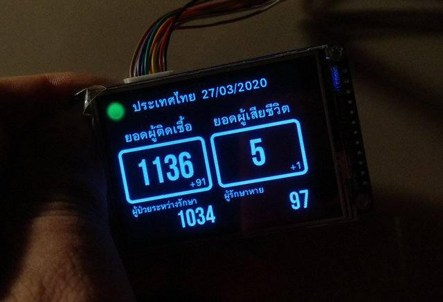
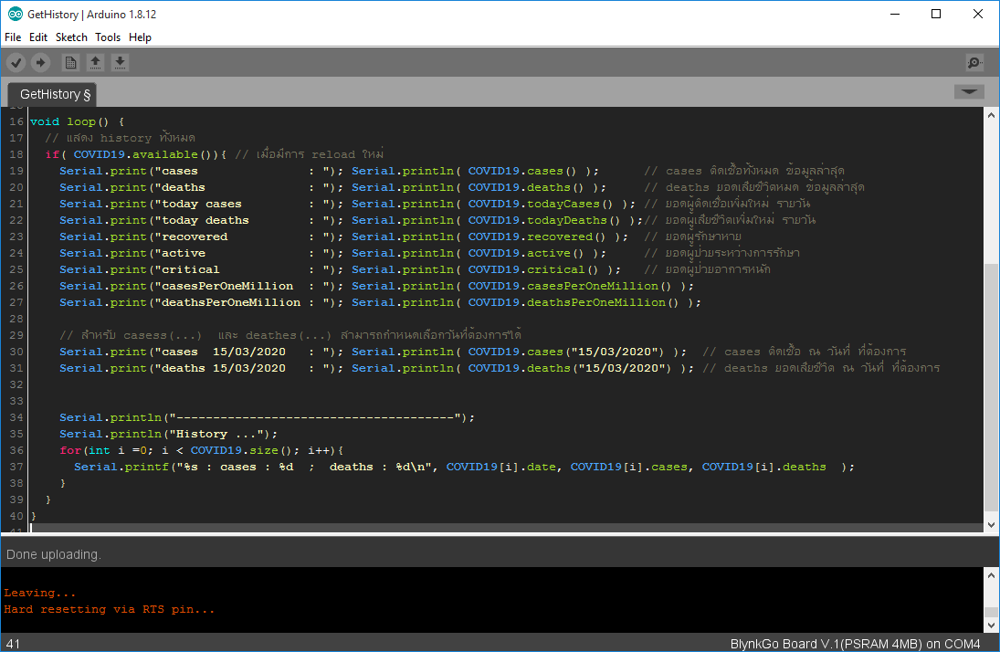

# TridentTD_COVID19
A library for COVID-19  cases, deaths and etc.  by specific country  on ESP32  
ไลบรารี่ สำหรับ ดึงข้อมูลยอดผู้ป่วยสะสมโรคระบาด COVID-19 สำหรับ ESP32  
สามารถ นำค่าไปใช้งาน ในโปรเจคต่างๆได้ต่อไป...  

  

## วิธีใช้
1. เรียกไลบรารี่

```cpp
#include <TridentTD_COVID19>
```

2. เริ่มการทำงาน โดยกำหนดประเทศที่ต้องการ  
(จะมีการ reload เพื่อทำกาน update ให้อัตโนมัติทุกๆ 15 นาที)  

```cpp
COVID19.begin("thailand");
```

3. เรียกใช้ข้อมูล เมื่อมีการ reload ทำการ update มาใหม่

```cpp
void loop() {
  if( COVID19.available()){
    Serial.println(COVID19.cases());             // แสดงยอดผู้ป่วยสะสม ล่าสุด
    Serial.println(COVID19.cases("22/03/2020")); // แสดงยอดผู้ป่วยสะสม วันที่กำหนด  ( date/month/year )
  }
```
( ค่าอื่นๆ ดูในตัวอย่าง examples ของไลบรารี่ )  

  
  
  
### TridentTD  
#### 27 Mar 2020
#### (year of COVID-19 ) 


